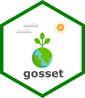

<!-- badges: start -->
[](https://cran.r-project.org/package=gosset)
[](https://cran.r-project.org/web/checks/check_results_gosset.html)
[](https://cran.r-project.org/package=gosset) 
[](https://zenodo.org/badge/latestdoi/173807877)
[](https://www.tidyverse.org/lifecycle/#maturing)
<!-- badges: end -->

# *gosset*: Tools for Data Analysis in Experimental Agriculture 

## Overview

The **gosset** package provides methods to implement workflows to analyse experimental agriculture data, from data synthesis to model selection and visualisation. The package is named after W.S. Gosset aka ‘Student’, a pioneer of modern statistics in small sample experimental design and analysis.

## Installation

The stable version is available through CRAN.

```r
install.packages("gosset")
```

The development version can be installed via

``` r
library("remotes")
remotes::install_github("agrdatasci/gosset")
```
## Examples

The functionality of **gosset** is illustrated in the package's vignettes

* [Trait prioritization and crop performance](https://agrdatasci.github.io/gosset/articles/vignette-1-trait-prioritization-and-crop-performance.html)


## Meta

  - Please [report any issues or bugs](https://github.com/AgrDataSci/gosset/issues).
  - License: MIT
  - Get citation information for *gosset* in R by typing `citation(package = "gosset")`.
  - You are welcome to contribute to the *gosset* project. Please read our [contribution guide lines](CONTRIBUTING.md).
  - Please note that the *gosset* project is released with a [Contributor Code of Conduct](CODE_OF_CONDUCT.md). By participating in the *gosset* project you agree to abide by its terms.
