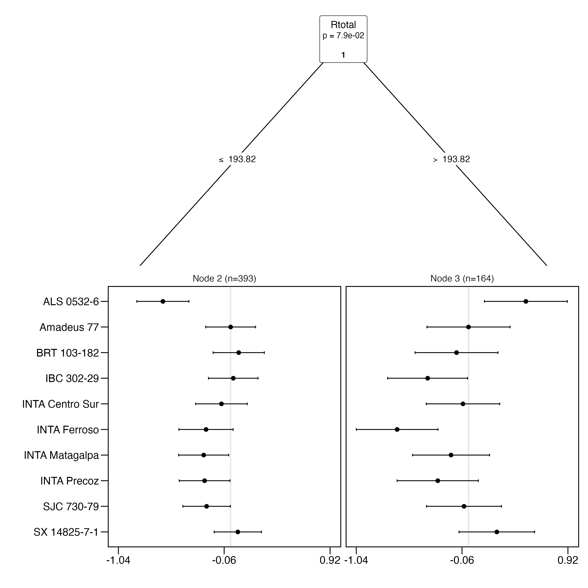
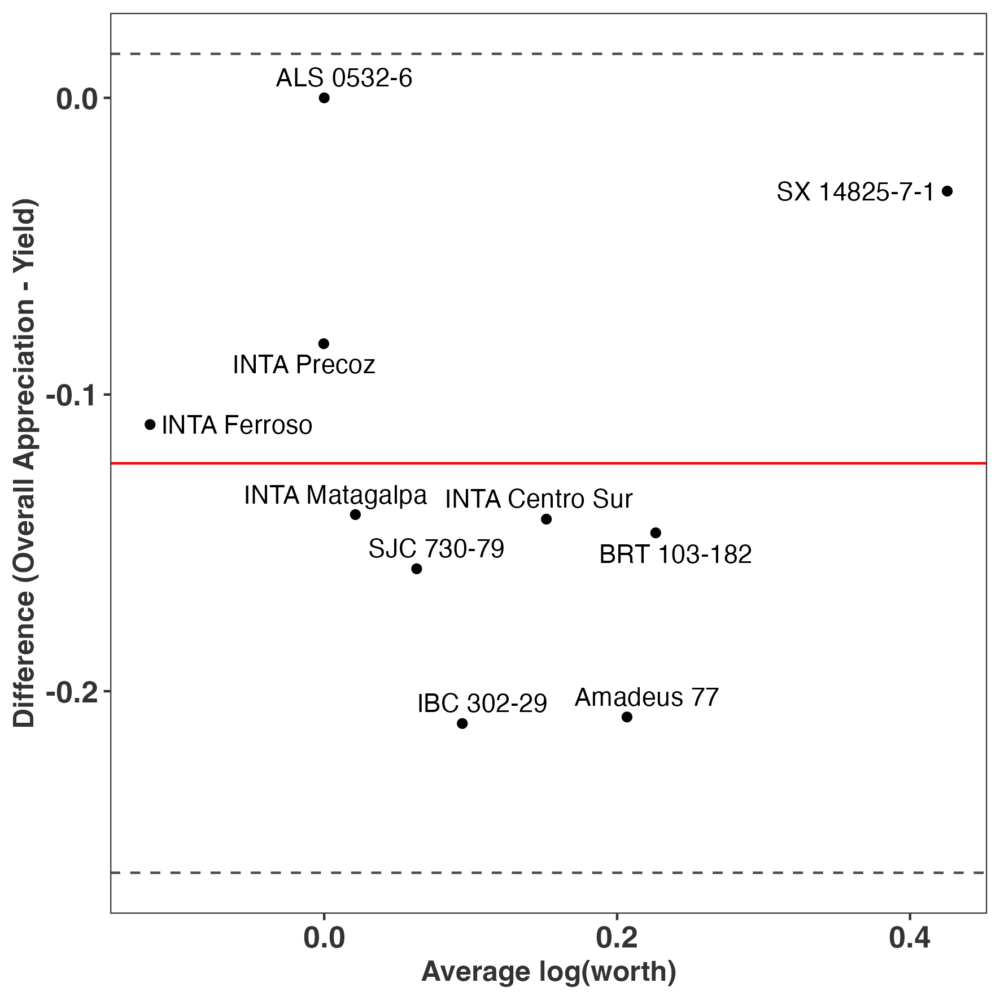

```{r setup_opts, include=FALSE}
library("knitr")
knitr::opts_chunk$set(echo = FALSE,
                      error = FALSE,
                      message=FALSE,
                      warning = FALSE)
```


>Kauê de Sousa^1,2[*]^, David Brown^3,4^, Jonathan Steinke^2,5^, Jacob van Etten^2^  
>-
>
^1^ Department of Agricultural Sciences, Inland Norway University of Applied Sciences, 2318 Hamar, Norway  
^2^ Digital Inclusion, Bioversity International, Parc Scientifique Agropolis II, 34397, Montpellier Cedex 5, France   
^3^ Laboratory of Geo-Information Science and Remote Sensing, Wageningen University & Research, Droevendaalsesteeg 3, 6708 PB, Wageningen, The Netherlands   
^4^ Digital Inclusion, Bioversity International, 30501, Turrialba, Costa Rica   
^5^ Thaer Institute of Agricultural and Horticultural Sciences, Humboldt University Berlin, Unter den Linden 6, 10099 Berlin, Germany  
^[*]^ Correspondence should be addressed to: <k.desousa@cgiar.org>

# Abstract

To derive insights from data, researchers working on agricultural experiments need appropriate data management and analysis tools. To ensure that workflows are reproducible and can be applied on a routine basis, programmatic tools are needed. Such tools are increasingly necessary for rank-based data, a type of data that is generated in on-farm experimentation and data synthesis exercises, among others. To address this need, we developed the R package gosset, which provides functionality for rank-based data and models. The gosset package facilitates data preparation, modelling and results presentation stages. It introduces novel functions not available in existing R packages for analyzing ranking data. This paper demonstrates the package functionality using the case study of a decentralized on-farm trial of common bean (*Phaseolus vulgaris* L.) varieties in Nicaragua.

::: frontmatter
::: keyword
**Keywords**: Bradley-Terry, data science, Plackett-Luce, on-farm trials, tricot approach
:::
:::

\newpage

# Code metadata {#required-metadata .unnumbered}

| **Code metadata description**                 | **Please fill in this column**                             |
|:--------------------------|:--------------------------|
| Current code version                                            | 0.4                                                       |
| Code repository    | <https://github.com/AgrDataSci/gosset>                    |
| Legal code license                                              | MIT                                                       |
| Code versioning system used                                     | git                                                       |
| Software code languages, tools, and services used               | R                                                         |
| Compilation requirements, operating environments & dependencies | R                                                         |
| Link to developer documentation             | <https://agrdatasci.github.io/gosset/>                    |
| Support email for questions                                     | [desousa.kaue@gmail.com](mailto:desousa.kaue@gmail.com){.email} |

: *Code metadata*

# Motivation and significance

Participatory on-farm experimentation approaches are reaching scale in agricultural research [@deRoo2019farm]. Participatory experiments often collect data as rankings, a format that is less common in other agricultural research settings [@Coe2002AnalyzingRA]. A recently developed approach for on-farm experimentation, triadic comparison of technologies (tricot), makes intensive use of data in ranking format [@vanetten_beza_2019]. Also, a newly proposed approach for synthesizing crop variety evaluation data largely depends on the analysis of ranking data [@brown2020data].

The analysis of ranking data requires the use of appropriate statistical models such as the Plackett-Luce model [@luce_individual_1959; @Plackett] or the Bradley-Terry model [@bradley1952rank]. Functionality for fitting these models is available in R with the packages BradleyTerry2 [@BradleyTerry2] and PlackettLuce [@Turner2020] respectively. However, extended functionality was required for the entire data science workflow, which usually includes: (1) Data preparation and cleaning, (2) modelling and validation, and (3) results presentation. For (1) gosset provides functions for converting and preparing data into a ranking or pairwise format required by the packages PlackettLuce and BradleyTerry2 respectively. For (2), gosset provides functions for model selection and validation using cross-validation. In the case of (3), enhanced functionality for plotting model results is provided by the gosset package.

# Software description

The R package gosset provides functionality supporting the analysis workflows in agricultural experimentation, especially for rank-based approaches. The package is available in the Comprehensive R Archive Network (CRAN) and can be installed by executing `install.packages("gosset")`. The package is named in honor of William Sealy Gosset, known by the pen name ‘Student’. Gosset was a pioneer of modern statistics in small sample experimental design and analysis. As a beer brewer at Guinness, he developed practical approaches to experimentation to compare barley varieties and beer brewing practices [@Ziliak_2019].

## Software Architecture

The R package gosset is structured following the guidelines described in the manual for creating R add-on packages [@r_extensions_2022]. This structure consists of files DESCRIPTION, LICENSE, NAMESPACE and NEWS, and directories data, dev, docs, inst, man, R, and vignettes. The package functions were developed following the S3 methods style [@r_extensions_2022] and are contained in the R sub-directory.

## Software Functionalities

### Data management and preparation

* `rank_binomial` transforms a ranking object into a binary comparison, as required by package BradleyTerry2 [@BradleyTerry2].  
* `rank_numeric` converts numeric values into rankings. The parameter `ascending = ` indicates if the rankings should be made considering the numeric values in ascending order. The default is `asceding = FALSE`. This function is useful when the data have been  collected as numerical observations, for instance, in an experiment measuring crop yield.  
* `rank_tricot` transforms data in tricot format into PlackettLuce rankings.

### Modelling

* `AIC` computes the Akaike Information Criterion [@akaike1974] for a Bradley-Terry model [@BradleyTerry2] or a Plackett-Luce model [@Turner2020].  
* `btpermute` deviance-based forward variable selection [@lysen2009permuted] procedure for Bradley-Terry models.
* `crossvalidation` performs k-fold cross-validation, where k could be specified by the user. The default is 10-fold. Folds can be provided as a vector for a custom cross-validation, such as blocked cross-validation.  
* `forward` executes forward variable selection with cross-validation.  
* `kendallTau` computes the Kendall-tau rank correlation coefficient between two rankings [@kendall_1938].  
* `kendallW` computes Kendall's W (coefficient of concordance) among observed rankings and those predicted by the Plackett-Luce model [@Kendall_1939].  
* `pseudoR2` computes goodness-of-fit metrics, such as McFadden's pseudo-R2 [@mcfadden1973conditional].  

### Visualization and results presentation

* `compare` is a visualization approach to compare measures from two different methods [@MartinBland1986].
* `plot` provides an alternative S3 method to `plot.pltree()` method implemented by the PlackettLuce package.  
* `regret` computes the regret coefficients, the loss under the worst possible outcome; a common heuristic
in risk assessment strategy [@Loomes_1982].  
* `reliability` computes the probability of a set of items outperforming a reference item; a common
heuristic in plant breeding [@eskridge_1992].  
* `worth_bar` creates a bar plot of the estimated *worth* for each evaluated item.  
* `worth_map` creates a heatmap plot of the estimated log-worth for all items considering each of the
evaluated traits.

# Illustrative example

To demonstrate the functionality of the gosset package, we use the `nicabean` dataset, which was generated with decentralized on-farm trials of common bean (*Phaseolus vulgaris* L.) varieties in Nicaragua over five seasons (between 2015 and 2016). Following the tricot  approach [@vanetten_beza_2019], farmers were asked to test in their farms three varieties of common bean. The varieties were randomly assigned as incomplete blocks, each representing 3 varieties out of a total set of 10 varieties. Each farmer assessed which of the three varieties in one incomplete block had the best and worst performance in eight traits (vigor, architecture, resistance to pests, resistance to diseases, tolerance to drought, yield, marketability, and taste). The farmers also provided their overall appreciation of the varieties, by indicating which variety had the best and the worst performance based on the overall performance considering all the traits. To analyze the data, we use the Plackett-Luce model implemented in the R package *PlackettLuce* [@Turner2020].


The `nicabean` dataset is a list with two data frames. The first, `trial`, contains the trial data with farmers’ evaluations, ranked from 1 to 3, with 1 being the higher ranked variety and 3 the lowest ranked variety for the given trait and incomplete block. The rankings in this dataset were previously transformed from tricot rankings (where participants indicate best and worst) to ordinal rankings using the function `rank_tricot()`. The second data frame, `covar`, contains the covariates associated to the on-farm trial plots and farmers. This example will require the packages PlackettLuce [@Turner2020], climatrends [@climatrends], chirps [@chirps] and ggplot2 [@ggplot2].

``` {r starting, message = FALSE, eval = TRUE, echo = TRUE}
library("gosset")
library("PlackettLuce")
library("climatrends")
library("chirps")
library("ggplot2")

data("nicabean", package = "gosset")

dat <- nicabean$trial

covar <- nicabean$covar

traits <- unique(dat$trait)

```

To start the data analysis, we transform the ordinal rankings into the Plackett-Luce rankings format (a sparse matrix) using the function `rank_numeric()`. We run iteratively over the traits adding the rankings to a list called `R`. Since the varieties are ranked in an ascending order, with 1 being the higher ranked and 3 the lower ranked, we use the argument `ascending = TRUE` to indicate which order should be used.

```{r rankings, message = FALSE, eval = TRUE, echo = TRUE}
R <- vector(mode = "list", length = length(traits))

for (i in seq_along(traits)) {

  dat_i <- subset(dat, dat$trait == traits[i])

  R[[i]] <- rank_numeric(data = dat_i,
                         items = "item",
                         input = "rank",
                         id = "id",
                         ascending = TRUE)
}

```

Then, using the function `kendallTau()` we assess the Kendall tau ($\tau$) coefficient [@kendall_1938]. This approach can be used, for example, to assess what traits influence farmers' choices or to prioritize traits to be tested in a next stage of tricot trials (e.g. a lighter version of tricot with no more than 4 traits to assess). We use the overall appreciation as the reference trait, and compare the Kendall tau with the other 8 traits.

```{r kendall1, message=FALSE, eval=TRUE, echo=TRUE}
baseline <- which(grepl("OverallAppreciation", traits))

kendall <- lapply(R[-baseline], function(X){
  kendallTau(x = X, y = R[[baseline]])
})

kendall <- do.call("rbind", kendall)

kendall$trait <- traits[-baseline]
```

The Kendall correlation shows that farmers prioritized the traits yield ($\tau$ = 0.749), taste ($\tau$ = 0.653) and marketability ($\tau$ = 0.639) when assessing overall appreciation.


```{r kendall2, message=FALSE, eval=TRUE, echo=FALSE}

kendall <- kendall[,c(3, 1)]
kendall[,2] <- round(kendall[,2], 3)

kable(kendall,
          caption = "Kendall tau correlation between 'overall performance' and the other traits assessed in the Nicaragua bean on-farm trials.",
          align = "l",
          row.names = FALSE)

```


Then, for each trait, we fit a Plackett-Luce model using the function `PlackettLuce()` from the package of the same name. This will allow us to continue the trial data analysis using the other functions in the package gosset.

```{r PLmodel, message=FALSE, eval=TRUE, echo=TRUE}

mod <- lapply(R, PlackettLuce)

```

The `worth_map()` function can be used to visually assess and compare item performance based on different characteristics. The values represented in a worth_map are log-worth estimates. From the breeder or product developer perspective the function `worth_map()` offers a visualization tool to help in identifying item performance based on different characteristics and select crossing materials.

```{r worthmap, message=FALSE, eval=TRUE, echo=TRUE, fig.cap="Trait performance (log-worth) of bean varieties in Nicaragua. Variety 'Amadeus' is set as reference (log-worth = 0). Blue values indicate a superior performance of varieties for a given trait, compared to the reference.  Red values indicate a variety with weak performance for the given trait, compared to the reference."}
worth_map(mod[-baseline],
          labels = traits[-baseline],
          ref = "Amadeus 77") +
  labs(x = "Variety",
       y = "Trait")
```

To consider the effect of climate factors on yield, we use agro-climatic covariates to fit a Plackett-Luce tree. For simplicity, we use the total rainfall (Rtotal) derived from CHIRPS data [@Funk2015], obtained using the R package chirps [@chirps]. Additional covariates can be used in a Plackett-Luce tree, for example using temperature data from R package ag5Tools [@ag5tools] or nasapower [@nasapower]. 

We request the CHIRPS data using the package chirps. Data should be returned as a matrix. This process can take some minutes to be implemented.

```{r chirps, message=FALSE, eval=FALSE, echo=TRUE}
dates <- c(min(covar[, "planting_date"]),
           max(covar[, "planting_date"]) + 70)

chirps <- get_chirps(covar[, c("longitude","latitude")], 
                     dates = as.character(dates),
                     as.matrix = TRUE,
                     server = "ClimateSERV")
```

```{r chirps2, message=FALSE, eval=TRUE, echo=FALSE}

load("nicabean_chirps.rda")

```

We compute the rainfall indices from planting date to the first 45 days of plant growth using the function `rainfall()` from package climatrends [@climatrends]. 

```{r chirps3, message=FALSE, eval=TRUE, echo=TRUE}
newnames <- dimnames(chirps)[[2]]
newnames <- gsub("chirps-v2.0.", "", newnames)
newnames <- gsub("[.]", "-", newnames)

dimnames(chirps)[[2]] <- newnames

rain <- rainfall(chirps, day.one = covar$planting_date, span = 45)
```

To be linked to covariates, the rankings should be coerced to a 'grouped_rankings' object. For this we use the function `group()` from PlackettLuce. We retain the ranking corresponding to yield.

```{r grouped_ranking, message=FALSE, eval=TRUE, echo=TRUE}
yield <- which(grepl("Yield", traits))

G <- group(R[[yield]], index = 1:length(R[[yield]]))
```

Now we can fit the Plackett-Luce tree with climate covariates. 

```{r pltree, message=FALSE, eval=TRUE, echo=TRUE}
pldG <- cbind(G, rain)

tree <- pltree(G ~ Rtotal, data = pldG, alpha = 0.1)
```

The following is an example of the plot made with the function `plot()` in the gosset package. The functions `node_labels()`, `node_rules()` and `top_items()` can be used to identify the splitting variables in the tree, the rules used to split the tree and the best items in each node, respectively.

```{r node_info, message=FALSE, eval=FALSE,echo=TRUE}
plot(tree, ref = "Amadeus 77", ci.level = 0.9)

node_labels(tree)

node_rules(tree)

top_items(tree, top = 3)
```

```{r pltree3, message=FALSE, eval=TRUE, echo=FALSE, out.width="60%", fig.align='center', fig.cap="Effect of total rainfall (Rtotal) on yield of common beans in on-farm trials. Agroclimate variables are obtained from planting date over the first 45 days of plant growth. The x axis presents log-worth, the log-probability of outperforming the other varieties in the set."}

```

We can use the function `reliability()` to compute the reliability of the evaluated common bean
varieties in each of the resulting nodes of the Plackett-Luce tree (Table 3). This helps in identifying the varieties with higher probability of outperforming a check variety (Amadeus 77). For the sake of simplicity, we present only the varieties with reliability $\geq$ 0.5.

```{r rel1, message=FALSE, eval=FALSE, echo=TRUE}
reliability(tree, ref = "Amadeus 77")
```

```{r rel2, message=FALSE, eval=TRUE, echo=FALSE}

rel <- reliability(tree, ref = "Amadeus 77")

rel <- rel[rel$reliability >= 0.5, ]

rel <- rel[c(1:5)]

rel[c(3:5)] <- lapply(rel[c(3:5)], function(x){round(x, 3)})

kable(rel,
      caption = "Reliability of common bean varieties based on yield performance under different rainfall conditions from planting date to the first 45 days of plant growth. Variety Amadeus 77 is set as reference.",
      align = "l",
      row.names = FALSE)

```

The results show that three varieties can marginally outperform Amadeus 77 under drier growing conditions (Rtotal $\leq$ 193.82 mm) whereas two varieties have a superior yield performance when under higher rainfall conditions (Rtotal $>$ 193.82 mm) compared to the reference. This approach helps in identifying superior varieties for different target population environments. For example, the variety ALS 0532-6 shows weak performance in the whole yield ranking, however for the sub-group of higher rainfall, the variety outperforms all the others. Combining rankings with socio-economic covariates could also support the identification of superior materials for different market segments.

A better approach for assessing the performance of varieties can be using the "Overall Appreciation", since we expect this trait to capture the performance of the variety not only for yield, but for all the other traits prioritized by farmers (Table 2). To assess this, we use the function `compare()` which applies the approach proposed by Bland and Altman (1986) [@MartinBland1986] to assess the agreement between two different measures. We compare overall vs yield. If both measures completely agree, all the varieties should be centered to 0 in the axis Y.

```{r compare, message=FALSE, echo=TRUE, eval=FALSE, out.width="50%"}
Overall <- PlackettLuce(R[[baseline]])
Yield <- PlackettLuce(R[[yield]])

compare(Overall, Yield) +
  labs(x = "Average log(worth)",
       y = "Difference (Overall Appreciation - Yield)")
```

The chart shows no complete agreement between overall appreciation and yield. For example, variety SX 14825-7-1 shows superior performance for overall appreciation when compared with yield. Looking at the log-worth in the heat map of Figure 1, we can argue that the superior performance of the given variety is also related to taste, marketability and diseases resistance. This performance, however, was not captured when assessing only yield.

```{r compare2, message=FALSE, eval=TRUE, echo=FALSE, out.width="50%", fig.align='center', fig.cap="Agreement between overall appreciation and yield for crop variety performance in on-farm trials."}

```

Here we present a simple workflow to assess crop variety performance and trait prioritization in decentralized on-farm trials with the tricot approach. A more complex workflow would also utilize other functions available in gosset, Examples include: (1) a forward selection combined with `crossvalidation()` to improve model robustness, or (2) model selection with `btpermute()` to consider all possible permutations in Bradley-Terry models, or (3) a risk analysis using `regret()` to support the selection of varieties, or also (4) using `rank_numeric()` to combine legacy data and deal with heterogeneous data from different trials. All of these were previously implemented and validated elsewhere [@vanEtten2019; @Moyo_2021; @deSousa2021; @Steinkemindata2019; @brownlegacydata].   

# Impact

Reproducible and efficient workflows are fundamental in scientific research (Lowndes et al. 2017) [@Lowndes2017]. The gosset package provides functionality that was not previously available from other R packages and which enabled scientific studies based on the analysis of ranking data. This functionality allows reproducibility and greater efficiency of the entire workflow. The utility of the gosset package has been demonstrated by enabling studies based on the analysis of decentralized on-farm trial data and/or  heterogeneous data from different sources. For instance, van Etten et al. (2019) [@vanEtten2019], Moyo et al. (2021) [@Moyo_2021] and de Sousa et al. (2021) [@deSousa2021] applied the Plackett-Luce model in combination with recursive partitioning [@Turner2020; @Zeileis2008]. In these studies, the gosset package supported data preparation, model validation and results presentation tasks.

# Conclusions

We described the functionality of the R package gosset to support the synthesis and analysis of ranking data. The package provides functions that are not available in existing R packages for analyzing ranking data. We provided an illustrative example covering the main functionality across the stages involved in the analysis workflow.

# Conflict of Interest

The authors declare no conflict of interests.

# Acknowledgements {#acknowledgements .unnumbered}

We acknowledge Vincent Johnson (Science Writing Service of the Alliance of Bioversity International and CIAT) for English editing of this manuscript. The nicabean data was generated through the Cooperative Agreement AID-OAA-F-14-00035, which was made possible by the generous support of the American people through the US Agency for International Development (USAID). The package was developed as part of the CGIAR Research Program (CRP) on Climate Change, Agriculture and Food Security (CCAFS) and the (CRP) on Roots, Tubers and Bananas (RTB), which were carried out with support from the CGIAR Trust Fund and through bilateral funding agreements (details are at https://www.cgiar.org/funders). New analytical approaches were developed during the projects Accelerated Varietal Improvement and Seed Systems in Africa (AVISA) and 10000FARMS supported by the Bill and Melinda Gates Foundation. The views expressed in this document cannot be taken to reflect the official opinions of these organizations.

\newpage  

# References

::: {#refs}
:::